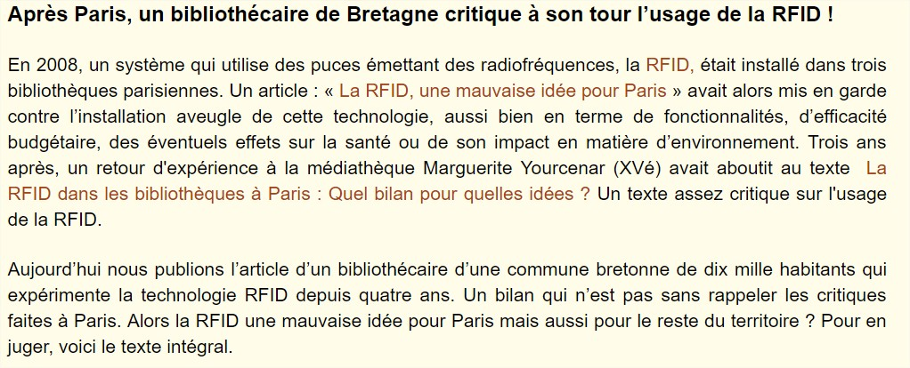
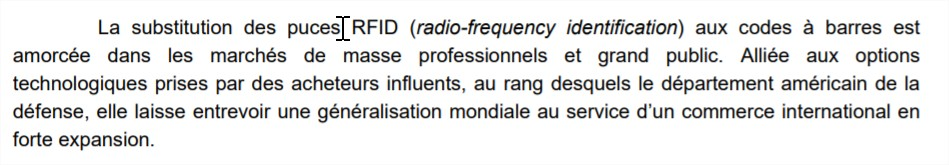

[Lien vers l'acceuil](../index.md)

# Cas d'utilisation 
 
## Introduction

Ces sources présentent l'utilité de la RFID en bibliothèque et dans des domaines divers ainsi que son application concrète.     

## Sources
 
### En bibliothèque 

1. MERGITUR, Social Nec. La RFID dans les bibliothèques à Paris : Quel bilan pour quelles idées ? Dans : Social Nec Mergitur [en ligne]. novembre 2011. [Consulté le 27 mai 2019]. Disponible à l’adresse : [http://parisculturesociale.over-blog.com/article-la-rfid-a-paris-quel-bilan-pour-quelles-idees-90693777.html](http://parisculturesociale.over-blog.com/article-la-rfid-a-paris-quel-bilan-pour-quelles-idees-90693777.html).

2. POUILLIAS, Marie-Thérèse. RFID et bibliothèques [en ligne]. Bulletin des Bibliothèques de France (BBF). Janvier 2005, no 5, p. 56‑60. Disponible à l'adresse : [http://bbf.enssib.fr/consulter/bbf-2005-05-0056-004](http://bbf.enssib.fr/consulter/bbf-2005-05-0056-004)

3. ROBERT, Christophe. Bibliothèque et RFID. Bulletin des Bibliothèques de France (BBF). Janvier 2008, no 1, p. 96‑96. Disponible à l'adresse : [http://bbf.enssib.fr/consulter/bbf-2005-05-0056-004](http://bbf.enssib.fr/consulter/bbf-2005-05-0056-004) 

4. SOCIAL NEC MERGITUR. La RFID dans les bibliothèques : Une technologie qui pose des questions d’ordre sanitaire, éthique et écologique. Dans : Social Nec Mergitur [en ligne]. 2012. [Consulté le 27 mai 2019]. Disponible à l’adresse : [http://parisculturesociale.over-blog.com/article-la-rfid-dans-les-bibliotheques-une-technologie-qui-pose-des-questions-d-ordre-sanitaire-ethique-e-111955970.html](http://parisculturesociale.over-blog.com/article-la-rfid-dans-les-bibliotheques-une-technologie-qui-pose-des-questions-d-ordre-sanitaire-ethique-e-111955970.html).

### Dans des domaines divers 

1. GRALLET, Guillaume. Une semaine avec une puce sous la peau - Le Point [en ligne]. juin 2015. [Consulté le 6 juin 2019]. Disponible à l’adresse : [https://www.lepoint.fr/high-tech-internet/une-semaine-avec-une-puce-sous-la-peau-27-06-2015-1940461_47.php](https://www.lepoint.fr/high-tech-internet/une-semaine-avec-une-puce-sous-la-peau-27-06-2015-1940461_47.php).

2. HELLERMANNTYTON. Solutions d’identification RFID pour le suivi et le contrôle des ressources pour tout type d’industrie. [en ligne]. 2019. [Consulté le 6 juin 2019]. Disponible à l’adresse : [https://www.hellermanntyton.fr/competences/suivi-et-identification-rfid](https://www.hellermanntyton.fr/competences/suivi-et-identification-rfid).

3. KATAMBA, Paulin. Technologie RFID (Radio Frequency Identification) : Concepts et stratégie de mise en oeuvre. Mémoire de Master. Québec : Faculté des études supérieures de l’Université Laval, 2007.

4. LACHAUD, Carine, ROUGEAU, Patrick et DEHAUDT, Sylvain. Rapport de veille [en ligne]. France : CERIB Expertise concrète, septembre 2015. [Consulté le 8 juin 2019]. Disponible à l’adresse : [https://www.cerib.com/wp-content/uploads/2017/05/341-e-beton-interactif-capteurs-puces-rfid.pdf](https://www.cerib.com/wp-content/uploads/2017/05/341-e-beton-interactif-capteurs-puces-rfid.pdf).

5. NAMEN, Anderson Amendoeira, DA COSTA BRASIL, Felipe, ABRUNHOSA, Jorge José Gouveia, et al. RFID technology for hazardous waste management and tracking. Waste Management & Research [en ligne]. Septembre 2014, Vol. 32, no 9_suppl, p. 59‑66. DOI 10.1177/0734242X14536463.

6. POULLET, Yves et DARQUENNES, Denis. RFID : quelques réflexions introductives à un débat de société [en ligne]. 2006. [Consulté le 8 juin 2019]. Disponible à l’adresse : [http://www.crid.be/pdf/public/5632.pdf](http://www.crid.be/pdf/public/5632.pdf).

7. ROURE, Françoise, GORICHON, Jean-Claude et SARTORIUS, Emmanuel. Les technologies de Radio-Identification (RFID) : Enjeux industriels et questions sociétales. Rapport noII-B.9. France : Conseil Général des Technologies de l’Information, janvier 2005.

1. SANOGO, Yamoussa. Réalisation à l’aide d’une plateforme NI PXI-E d’un lecteur RFID reconfifurable pour des applications en milieux hostiles [en ligne]. Mémoire d’étudiant. Québec : Université du Québec à Trois-Rivières, novembre 2016. [Consulté le 8 juin 2019]. Disponible à l’adresse : [http://depot-e.uqtr.ca/7987/1/031471882.pdf](http://depot-e.uqtr.ca/7987/1/031471882.pdf).

2.  Les technologies RFID et les consommateurs sur le marché de la vente au détail - Le Bureau de la consommation [en ligne]. 5 décembre 2012. [Consulté le 20 mai 2019]. Disponible à l’adresse : [https://ic.gc.ca/eic/site/oca-bc.nsf/fra/ca02287.html](https://ic.gc.ca/eic/site/oca-bc.nsf/fra/ca02287.html).