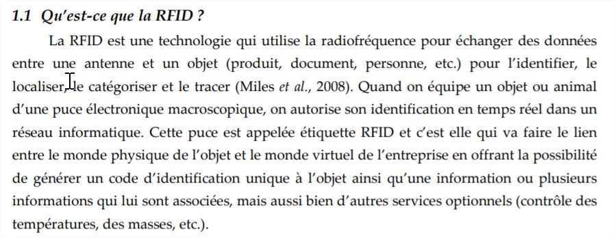

[Lien vers l'acceuil](../index.md)

# Définitions

## Introduction

Ces sources présentent ce qu'est la technologie RFID et plus précisément les puces RFID ainsi que leur fonctionnement. 

## Sources
1. BIBLIOTHÈQUE ET ARCHIVES NATIONALES DU QUÉBEC. La technologie Radio Frequency IDentification (RFID) [en ligne]. août 2017. [Consulté le 8 juin 2019]. Disponible à l’adresse : [http://www.banq.qc.ca/documents/services/espace_professionnel/milieux_doc/ressources/Libre_service/rfid.pdf](http://www.banq.qc.ca/documents/services/espace_professionnel/milieux_doc/ressources/Libre_service/rfid.pdf).

1. MARTIN, Tania. Le b.a.-ba de la RFID : Origines, Technologies et Applications [en ligne]. janvier 2014. [Consulté le 6 juin 2019]. Disponible à l’adresse : [https://www.smalsresearch.be/download/techno/Techno37_RFID_FR.pdf](http://www.internetactu.net/2009/02/11/rfid-20-des-puces-ou-des-ordinateurs/).

3. GROUPE RNI CARSAT-CRAMIF/INRS. Champs éléctroniques [en ligne]. septembre 2018. [Consulté le 8 mai 2019].

4. KATAMBA, Paulin. Technologie RFID (Radio Frequency Identification) : Concepts et stratégie de mise en oeuvre. Mémoire de Master. Québec : Faculté des études supérieures de l’Université Laval, 2007.

5. MANACH, Jean-Marc. RFiD 2.0 : des puces ou des ordinateurs ? Dans : InternetActu.net [en ligne]. 2019. [Consulté le 27 mai 2019]. Disponible à l’adresse : [http://www.internetactu.net/2009/02/11/rfid-20-des-puces-ou-des-ordinateurs/](http://www.internetactu.net/2009/02/11/rfid-20-des-puces-ou-des-ordinateurs/).

6. MEVEL, Olivier et LERAY, Yvan. LES PROMESSES RELATIVES A L’IMPLEMENTATION D’UNE SOLUTION RFID : LE CAS D’UNE CENTRALE D’ACHAT DE LA GRANDE DISTRIBUTION FRANÇAISE. [s. d.], p. 23.

7. NDIAYE, Khadidiatou et LEBORGNE, Aymeric. Comprendre la technologie RFID [en ligne]. Paris : Illetneuse Université Paris 13 (IUT), 2017 2016. [Consulté le 20 mai 2019]. Disponible à l’adresse : [https://lipn.univ-paris13.fr/~loddo/files/PROJETS-TUTORES_2016-17/RAPPORTS_2017/g08_FABRE_projet_RFID_LEBORGNE_NDIAYE.pdf](https://lipn.univ-paris13.fr/~loddo/files/PROJETS-TUTORES_2016-17/RAPPORTS_2017/g08_FABRE_projet_RFID_LEBORGNE_NDIAYE.pdf).

8. Les technologies RFID et les consommateurs sur le marché de la vente au détail - Le Bureau de la consommation [en ligne]. 5 décembre 2012. [Consulté le 20 mai 2019]. Disponible à l’adresse : [https://ic.gc.ca/eic/site/oca-bc.nsf/fra/ca02287.html](https://ic.gc.ca/eic/site/oca-bc.nsf/fra/ca02287.html).

9.  La RFID qu’est-ce que c’est ? Dans : Tribofilm [en ligne]. 24 octobre 2017. [Consulté le 20 mai 2019]. Disponible à l’adresse : [https://www.tribofilm.fr/la-rfid-quesaco/](https://www.tribofilm.fr/la-rfid-quesaco/).
    
10. RFID - Avantages et inconvénients ; Manuel RFID ; RFID - Moins ; puces RFID chez l’homme [en ligne]. [s. d.]. [Consulté le 20 mai 2019]. Disponible à l’adresse : [http://fr.abcarticulos.info/article/rfid-avantages-et-inconvnients](http://fr.abcarticulos.info/article/rfid-avantages-et-inconvnients).

