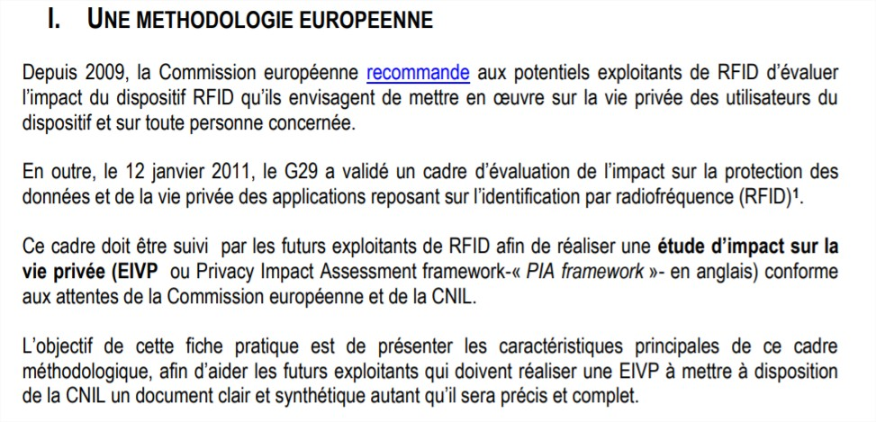
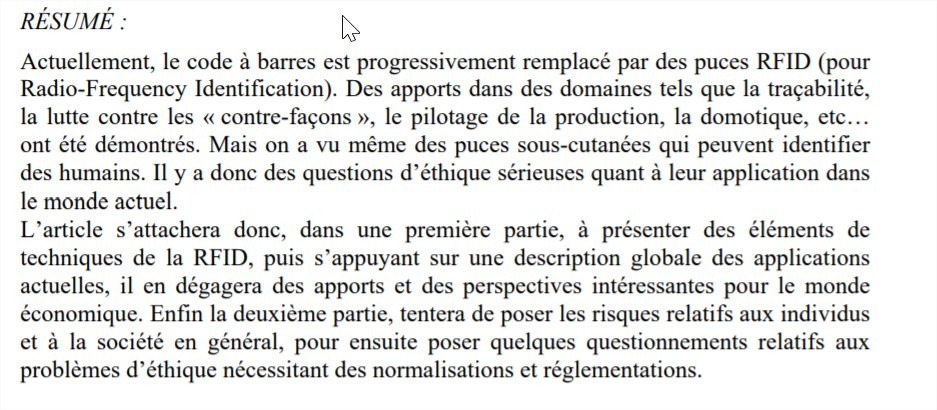

[Lien vers l'acceuil](../index.md)

# Le plan éthique de la technologie

## Introduction

Ces sources donnent un aperçu des dangers de la technologie concernant le respect de la vie privée et nous permettent de garder un regard critique. 

## Sources

1. COMISSION NATIONALE DE L’INFORMATIQUE ET DES LIBERTÉS. Réaliser une évaluation d’impact sur la vie privée (EIVP) pour les dispositifs RFID. septembre 2013.

2. COMMISSION DE LA PROTECTION DE LA VIE PRIVÉE. Avis d’initiative relatif à la RFID (A/2009/003) [en ligne]. octobre 2009. [Consulté le 8 juin 2019]. Disponible à l’adresse : [https://www.autoriteprotectiondonnees.be/sites/privacycommission/files/documents/avis_27_2009_0.pdf](https://www.autoriteprotectiondonnees.be/sites/privacycommission/files/documents/avis_27_2009_0.pdf).

3. DORRESTIJN, Steven. Michel Foucault et l’éthique des techniques Le cas de la RFID. Mémoire de Master II. Paris : Université Paris X, Nanterre, 2006. Vie privée et la RFID, problèmes d’éthiques de la RFID, usage technique RFID, RFID et vie privée.

4. MADINIER, Anne-Lise. La surveillance de demain : puces RFID et implants sous-cutanés. Dans : SÉGUR, Philippe et LABROT, Émilie (dir.), Un monde sous surveillance ? [en ligne]. Perpignan : Presses universitaires de Perpignan, 29 septembre 2017, p. 129‑146. [Consulté le 27 mai 2019]. ISBN 978-2-35412-294-2. Disponible à l’adresse : [http://books.openedition.org/pupvd/3969](http://books.openedition.org/pupvd/3969).

5. SOCIAL NEC MERGITUR. La RFID dans les bibliothèques : Une technologie qui pose des questions d’ordre sanitaire, éthique et écologique. Dans : Social Nec Mergitur [en ligne]. 2012. [Consulté le 27 mai 2019]. Disponible à l’adresse : [http://parisculturesociale.over-blog.com/article-la-rfid-dans-les-bibliotheques-une-technologie-qui-pose-des-questions-d-ordre-sanitaire-ethique-e-111955970.html](http://parisculturesociale.over-blog.com/article-la-rfid-dans-les-bibliotheques-une-technologie-qui-pose-des-questions-d-ordre-sanitaire-ethique-e-111955970.html).

6. THOMAS, André. RFID et nouvelles technologies de communication; enjeux économiques incontournables et problèmes d’éthique. Dans : 6ème Conférence Internationale Conception et Production Integrées, CPI’2009 [en ligne]. Fès, Morocco, octobre 2009. [Consulté le 27 mai 2019]. Disponible à l’adresse : [https://hal.archives-ouvertes.fr/hal-00442873](https://hal.archives-ouvertes.fr/hal-00442873). 

7. NAMEN, Anderson Amendoeira, DA COSTA BRASIL, Felipe, ABRUNHOSA, Jorge José Gouveia, et al. RFID technology for hazardous waste management and tracking. Waste Management & Research [en ligne]. Septembre 2014, Vol. 32, no 9_suppl, p. 59‑66. DOI 10.1177/0734242X14536463.

8. SERIOT, Nicolas. Les systèmes d’identification radio (RFID) [en ligne]. Janvier 2005, p. 25. Disponible à l'adresse : [http://seriot.ch/resources/talks_papers/rfid/rfid.pdf](http://seriot.ch/resources/talks_papers/rfid/rfid.pdf).
